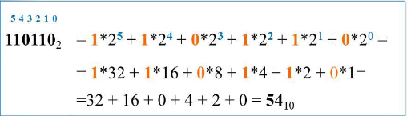
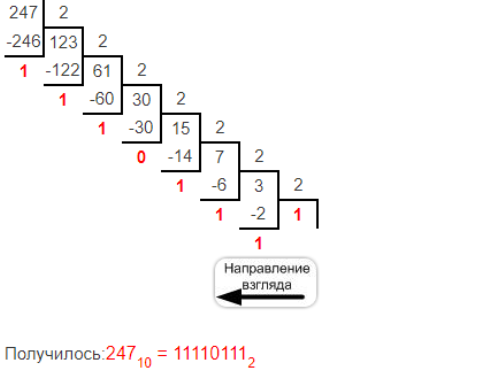

# Задание № 14
## Кодирование чисел. Системы счисления


[Ссылка на задания (Решу ЕГЭ)](https://inf-ege.sdamgia.ru/)

### **О задании**


В этом задании нам требуеться уметь работать с системами счисления в python.
В python это не так уж и сложно, если считать, что в нем уже есть функция перевода в десятичную систему счисления.


Есть несколько вариантов данного задания:
1. [Операции в разных системах счисления c двумя переменными](https://inf-ege.sdamgia.ru/test?theme=274)
2. [Операции в разных системах счисления c одной переменной](https://inf-ege.sdamgia.ru/test?theme=239)
3. [Операции в одной системе счисления](https://inf-ege.sdamgia.ru/test?theme=220)
4. [Прямое сложение в системе счисления](https://inf-ege.sdamgia.ru/test?theme=247)


### **Варианты решения**

Первые три варианта очень похожи. Стоит сказать, что для реешния этого задания требуеться знать как переводить из одной системы счисления в другую. 

Приведу примеры того, как можно легко переводить из одной сисстемы в другую.

1. Вручную:
   
    **ДАННЫЙ ВАРИАНТ НЕ РАЦИОНАЛЕН**

    Для перевода из двоичной СС в десятичную необходимо проиндексировать (пронумеровать начиная с нуля) все цифры начиная с конца и далее перемножать эту цифру на основание СС в степени индекса.
    
    Далее просто суммируем доконца. 

    

    Для перевода из десятичной в какую-то другую необходимо число делить на СС в которую переводим до тех пор пока не получиться что-то неделимое. При этом каждое новое деление мы делим остаток от деления на прошлое число.
    После всех операций записываем ответ, беря остатки от деления и результаты делений начиная с конца.

    


    ОЧень неэффективный метод решения. Между прочим у нас будет установлен python! Зачем усложнять себе жизнь?


2. С помощью python функций:
   
   К примеру у нас есть функция `bin(число в десятичной СС)` на выходе мы получим строку в виде двоисной записи этого числа.

   Таким же образом работают эти функции:

   | **Название** | **Система счисления** | **Выходные данные** |
    |:----------:|:----------:|:----------:|
    | bin(int)    | 2   | str   |
    | oct(int)    | 8   | str   |
    | hex(int)    | 16  | str   |
    | int(str, int)    | 10  | int   |

    Но что делать, если  нужно перевести в ту систему, которая по умолчанию не поддрживается в python?

    Напишем свою функцию, которая будет переводить из десятичной СС (потому что есть int() для простого перевода в 10-ную СС) в какую-либо другую. Назовем её `number_system`.

    ```python
    # функция перевода из десятичной в другую СС
    def number_system(num:int, osn:int) -> str:
        res:str = ""
        
        alf = [chr(i) for i in range(ord("A"), ord("Z") + 1)]
        while num != 0:
            add_res = num%osn
            if add_res >= 10:
                res = alf[add_res-10] + res
            else:
                res = str(num%osn) + res
            num//=osn
        
        return res
    ```

    В этой функции первым аргументом мы пишем исходное число, в качестве второго аргумета пишем систему счисления, в которую хотим перевести. 
    
    Функция вернет строку.

    В переменной `res` будет записан результат выполнения функции. 

    В переменной `alf` записан алфавит английских букв. Это нужно для СС, которые больше (либо равны) 10.

    В цикле while, который будет действовать пока наше исходное число не станет 0 мы создаем новую переменную `add_res`, которую мы будем добавлять к нашему результату. 
    
    Но! Перед добавлением стоит проверить, может быть это число превышает 10, это значит, что нам следует присвоить ей буквенное значение из массива alf.

    После добавления необходимо целочисленно разделить исходное число на основание, чтобы отрезать лишнее.

    В конце возвращем результат выполнения функции.

В большинстве случаев нам потребуеться подобрать некую цифру `X` для того, чтобы так, чтобы выражение соответсвовало условию.

Первые два тпа задний не отличаються друг от друга, там необходимо подобрать такие x, при которых выражение будет кратно какому-то N и вывести частное.

В третьем случае нам потребуеться подобрать уже две значения x и y, так чтобы выражение было кратно N.

В четвертом варианте просто неоходимо посчитать выражение, перевести в нужную СС и вывести количество каких-то знаков. Главное помнить, что все функции python выдают еще два первых знака, которые необходимо обрезать.


Задание не сложное и выполняеться быстро, главное помнить и понимать как переаодить из одной СС в другую. Для этого можно использовать код, указанный выше.
    