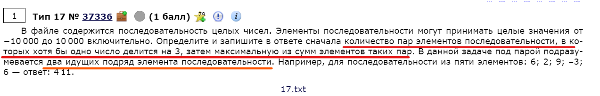
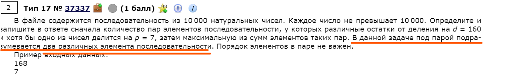

# Задание № 17
## Обработчик цифровой последовательности.


[Ссылка на задания (Решу ЕГЭ)](https://inf-ege.sdamgia.ru/)

### **О задании**


В этом задании нам нужно будет работать с файлами, который будет предоставлен.
Важно понимать, как работать с файлом и внимательно следовать условию.

Задание оцениваеться в один балл.

Решение приведено на языке программирования python.


### **Варианты решения**

Полный код задачи находиться в [файле](task17.py)

Для решения данной задачи необходимо внимательно прочитать условие задчи.
От него зависит сам алгоритм:



В этой задаче красным подчеркнуто условие, а оранжевым важная пометка!

1. Для начала открываем файл и записываем содержимое файла в переменную `ls` как целочисленное значение:

```python
# открываем файл
file = open("17.txt")
# записываем содержимое файла в переменную
ls:list = [int(i) for i in file.readlines()]
```

2. Создадим две переменные, которые будут в роли счетчика и максимальной суммы:

```python
count:int = 0
max_summ:int = min(ls)
```

В качестве значения для второй переменной возьмем самое маленькое значение в массиве `ls`. Таким образом мы гарантируем верный результат при выполнении.

3. Пробегаемся по всем значениям в масиве и проверям их по условию:

```python
# перебираем все эллементы
for i in range(1, len(ls)):
    # проверяем по условию
    if ls[i] % 3 == 0 or ls[i-1] % 3 == 0:
        count += 1
        # вычисляем наибольшее число между текущим и суммой двух текущих
        max_summ = max(max_summ, ls[i] + ls[i-1])
```


4. Выводим ответ согласно заданию:
```python
# выводим ответ: 1-м количество, затем максимальную сумму.
print(count, max_summ)
```

При этом если условие было бы другим, то алгоритм мог координально поменяться:



Здесь уже придеться делать цикл в цикле, чтобы алгоритм сработал верно:

```python
for i in range(len(ls) - 1):
    for g in range(i, len(ls) - 1):
        ...
```

Таким образом не обязательно, чтобы эллементы находились близко друг к другу.

<br>

На этом все. Задание вовсе не сложное, главное внимательно читать условие и подбирать под это условие алгоритм действий.