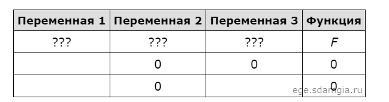

# Задание № 2
## Постороение таблиц истиности логических выражений


[Ссылка на задания (Решу ЕГЭ)](https://inf-ege.sdamgia.ru/)

### **О задании**


В этом задании нам необходимо востановить таблицу истиности. Часть таблицы нам уже дана, по этим данным нам необходимо подобрать параметры по заданию.

Во втором задании нужно понимать что такое таблица истиности и как она выглядит. 
Решение представлено на языке программирования python. 


### **Варианты решения**

Для решения данного типа заданий слудует использовать полный перебор всех вариантов для всех переменных согласно заданию.

При работе с таблицой истиности мы используем исключительно 0 и 1. Где 1 - обозначает true, а 0 - false.

Ниже представлена таблица основных логических операций


Проще говоря:
| **назнание**  |   **значок** | **python**|
|:-------------:|:-------------:|:----------|
|       отрицание       |    ¬      |   not     |
|коньюнция(логическое И)|      ∧    |   and     |
|дизьюнция(логическое ИЛИ) | V   |  or |
| Следование | ->   |  >=    |
|Эквивалентсность| ≡ | == |

Используя эти логические операции, можно ссотавить логическое выражение, по которому мы сможем построить талицу истиности.



Используем полные перебор всех значений:
```python
for x in range(2):
    for y in range(2):
        for z in range(2):
            ...
```

К примеру у нас есть выражение `(x ∨ y) → (z ≡ x)`, которое должно быть *false*, в таком случае пропишем ```not function```.

выведем все переменные:
```python 
# здесь должны быть все ваши переменные
print(x, y, z)
```

Теперь нам нужно менять местами переменные до тех пока мы не получим более правдопадобную картину.

```python 
# после перестановки переменных
print(x, z, y)
```


При второй перестановке параметров я получил что-то похожее на то, что от меня хотят.

Соответсвенно та перестановка, которая подошла и есть ответ!

Пример полного кода содержиться в [файле](task2.py).

Задание не отличаеться особой сложнстью. Здесь самое сложное это правильно подобрать параметры. Когда их много, то это сдлеать весьма трудно и долго, но все равно это самый эффестивный способ решения.
