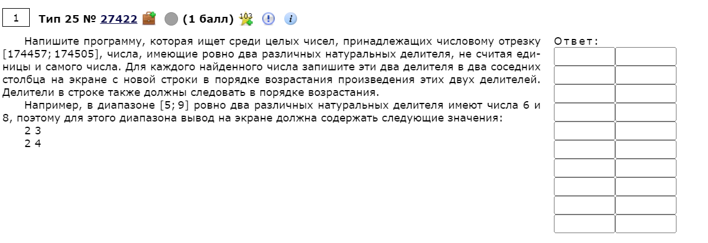

# Задание № 25
## Обработка целочисленной информации


[Ссылка на задания (Решу ЕГЭ)](https://inf-ege.sdamgia.ru/)

### **О задании**

В 25-ом задании нас просят написать программу, которая на определенном отрезке находит все числа, с определенным количесвтом делителей.

Не смотря на то, что задание уже под номером 25, оно не сложенее предыдущих.

Решение представлено на языке программирования python.


### **Варианты решения**

В этом примере я буду использовать некоторые свойства функций, которые многим известны.

[Полный код](task25.py) здесь!




Я пропишу подобную логику:
1. Создам цикл с диапазоном от 174457 до 174505 включительно:
   ```python
    for number in range(174457, 174505 + 1):
        ...
   ```
2. Создам функцию, которая бы возвращала массив со всеми делителями числа *number*:
   ```python
    def dividers(num:int) -> list:
        list_dividers:list = []
        for x in range(2, num//2 + 1):
            if num % x == 0:
                list_dividers.append(x)
        return list_dividers
   ```

   Здесь важно понимать, что нам не нужно учитывать 1 и само это число.

   ```
    Для нахожнения делителей числа достаточно проверить остаток от деления этого числа на число из диапазона:
    [2; половина от исходного числа с округлением в большую сторону].
   ```

   Теперь мы можем вернуть массив с получившимися делителями.

3. Теперь подставим каждое число из диапазона в эту функцию
   
    ```python
    res = dividers(number)
    ```

4. Проверим длину массива, по нашему условию она должна быть 2, т.е есть всего два целых делителя.
    ```python
    if len(res) == 2:
        print(*res)
    ```


Подобным способом решаются и остальные 25-е задания.

По заданию видно, что алгоритм не очень сложный, его достаточно понять и использовать.