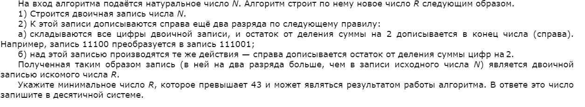

# Задание № 5
## Анализ и постороение алгоритмов для испольнителей

[Ссылка на задания (Решу ЕГЭ)](https://inf-ege.sdamgia.ru/)

### **О задании**

    В пятом задании нам требуеться уметь правильно анализировать условие и уметь составлять по этому условию программу. Для этого необходимы базовые знания в программировании.

Задание разделяеться на два типа:
1. [Посимвольное двоичное преобразование](https://inf-ege.sdamgia.ru/test?theme=362)
2. [Посимвольное десятичное преобразование](https://inf-ege.sdamgia.ru/test?theme=221)

Решение обоих типов происходит схожими способами.

### **Варианты решения**

При решении, рекомендуется использовать программирование с функциями.

Можно составить функцию (с названием `task` к примеру) и просто прогнать все значения через цикл for.

Пример на python - [пример](/tasks/task5/task5.py)

В функцию мы последовательно записали то, что нам требуеться по условию. 
1. Преобразовали в двоичный вид
2. Нашили и прибавили остаток от деления сумму цифр на 2 (по условию)
3. Нашили и прибавили остаток от деления сумму цифр на 2 второй раз (число уже поменялось)
4. Возвращаем число в десятичном виде.

Далее сравниваем получившиеся значение с константной 43. Если больше, то выведем это число и завершим работу цикла (нам ведь нужно минимальное число).

Ответ получен! В целом все задания под номером 5 решаются схожим образом. Все что нам необходимо сделать - это линейно записать то, что нас просят.

