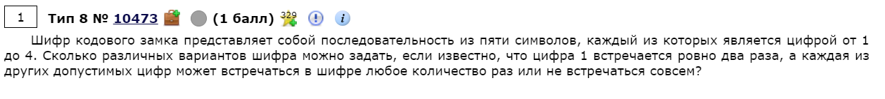
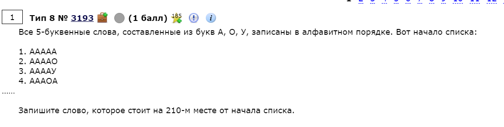

# Задание № 8
## Перебор слов и систем счисления


[Ссылка на задания (Решу ЕГЭ)](https://inf-ege.sdamgia.ru/)

### **О задании**


В 8-ом задании требкуеться уметь делать полный перебор всех значений с условие. Это задание очень хорошо решается с помощью python и встроенной бибилиотеки python `itertools`. 

Есть нескоько типов данного задания:
1. [Подсчет количества разных последовательностей](https://inf-ege.sdamgia.ru/test?theme=395)
2. [Подсчет количества слов с ограничениями](https://inf-ege.sdamgia.ru/test?theme=379)
3. [Слова по порядку](https://inf-ege.sdamgia.ru/test?theme=243)


Все задания решаются по похожему друг на друга алгоритму.


### **Варианты решения**

Перебирать все варианты вручную очень долго и так легко ошибиться, поэтому для решения данного задания будем использовать *python* вместе с *itertools*.

Выбор функции из модуля itertools зависит от конкретного задания:

1. Если нам надо перебрать все значения из **определенной последовательности**, то используем метод - `itertools.permutations()`.

    > from iterttols import permutations

   Этот метод на вход получает итерируемый обьект (массив, список, строку и т.п)

   Пример использования:
   ```python
    from itertools import permutations
    # строка котрую будем перебирать
    s = "12345"

    for var in permutations(s):
        # на выходе получем tuple
        print(var)
   ```

   Таким образом мы выведем все варианты перебора строки *s*. 

2. Если нам надо перебрать какой-то иттерируемый объект **определенное количество раз**, то требуеться использовать метод `itertools.product()`, который принимает иттерируемый обьект и размер вызодного кортежа. 

Пример использования:
```python
from itertools import product

# строка котрую будем перебирать
s = "12345"
# длина кортежей
n = 10
# repeate - это параметр, который определяет длину выходного кортежа
for var in product(s, repeate=n):
    # на выходе получем tuple
    print(var)
```

Таким образом мы переберем все варианты и комбинации строки *s*, размером *n*.

Это две основные функции для данного задания.

### Теперь рассмотрим как можно решать задние:

Полный код находиться в [файле](task8.py)



В данном задании нам потребуеться использовать метод *product*

```python
import itertools

# создаем строку, которую будем перебирать
s = "1234"
# создаем счетчик
count_varios = 0

# по условию длина полсдеовательности равна 5 символов
for varios in itertools.product(s, repeate=5):
    # создаем условие по заданию
    # количество едениц строго равно 2
    if varios.count("1") == 2:
        count_varios += 1

prijnt(count_varios)
```

То, что наша программа выведет, и будет являться ответом для дпнной задачи.

Второе задание:


Так же как и в перевом варианте нам потребуеться метод `product()`

```python
import itertools


# строка для перебора
s = "ЕГЭ"
# создаем счетчик
count_varios = 0

# длина опять же равна 5
for var in itertools.product(s, repeat=5):
    # пишем условие по заданию
    # начинаеться с гласной
    if var[0] in ["Е", "Э"]:
        count_varios += 1

print(count_varios)
```

Алгоритм очень похож на тот, что мы использовали выше, единственное, что изменилось - это теперь мы перебираем буквы и изменили от этого условие.



В этом задании опять потребуеться метод `product()`

```python
import itertools


# строка для перебора
s = "АОУ"
# создаем счетчик начинающийся с 1
count_varios = 1

# длина опять же равна 5
for var in itertools.product(s, repeat=5):
    # пишем условие по заданию
    # если это 210 по счету
    if count_varios == 210:
        # выводим ответ
        print(''.join(var))
        # выходим из цикла
        break
    else:
        count_varios += 1
```


Данное задание имеет одинаковый алгоритм решения. Поэтому они не вызывают большой сложности. Для этого лучше ипользовать python, в силу того, что тот имеет отличную для этих заданий `itertools`.

