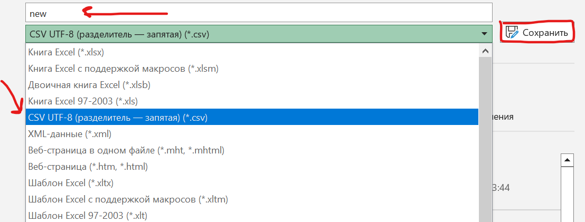
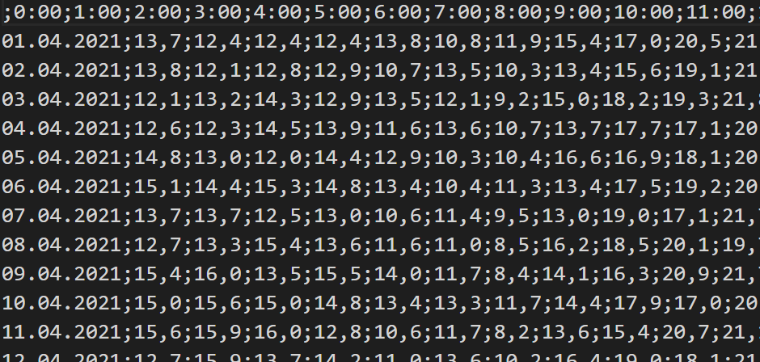

# Задание № 9
## Работа с элекронными таблицами


[Ссылка на задания (Решу ЕГЭ)](https://inf-ege.sdamgia.ru/)

### **О задании**


В этом задании нам требуеться умение работать с файлами электронных таблиц. Мы можем использовать два варианта решения: 

1. Использовать Exel (или что-то подобное, завист от установленного софта)
2. Использовать Python для работы с фалйлами.


Рассмотрим оба виарианта.

### **Варианты решения**


1. Через Exel:
   
   Открываем файл, который указан в задании. Перед нами таблица, с которой нам предстоит работать.

   При выборе этого варианта, нам желательно знать конструкции в Exel.
   Например:

   ```
   =МАКС(*диапазон*)

   =МИН(*даипазон*)

   =СРЕДЗНАЧ(*диапазон*)
   и т.д
   ```
    Теперь мы можем пролистать в правую часть таблицы и начать работу там. 
    Вводим необходимые параметры, согласно заданию. 

    `Если возникают какие-то неполадки, например, как на картинке ниже, то просто формат данных в ячейках нажатием правой кнопкой мыши по ячейке`

    

    

    Выберите тип ячейки `"Числовой"` и данные придут в порядок.

Таким образом можно решить 9-о задание при помощи Exel и подобных программ. Метод довольно прост и не требует особенных знаний в области программирования.

2. Решение через Python:

При решении данного задания через python потребуеться умение работать с файлами табличного.

Перед началом работы потребуеться подготовить файл. Для этого открываем его в том же Exel, и сохраняем в формате `CSV` с разделителем - *запятая*. При этом можно переименовать файл по вашему усмотрению.



Вы получите что-то похожее:



Для работы с файлми в python используеться оператор `open(filename)`.

В [файле](task9.py) я описал некоторые возможные варанты поиска ответа на вопросы задачи. 

Если вы умеете работать с файлами, то вам не составит труда написать код, который ищет нужное значение.

Если вы умеете работать с файлами в python, то вы можете выполнять задание через него. Однако, на мой взгляд, решать через Exel и подобные программы гораздо проще и быстрее, а значит и эффективнее.
   